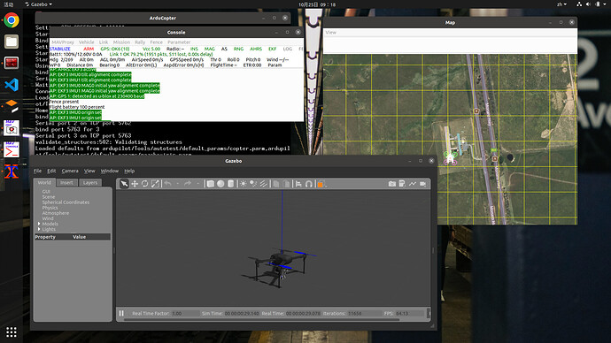

# Ardupilot Gazebo plugin

This plug-in was developed by the Octan team to operate multiple fixed-wing aircraft using ROS in a virtual world that supports barcodes and cameras.

### Requirements：

ubuntu20.04、Gazebo Classic 11、ROS-Noetic



### Setup：

1、Gazabo and plugin

```bash
sudo apt-get install libgazebo11-dev	
git clone https://github.com/Haris-Alsaman/ardupilot_gazebo.git
cd ardupilot_gazebo
mkdir build
cd build
cmake ..
make -j4
sudo make install
```

2、sources 

```
sudo vim ~/.bashrc

source /usr/share/gazebo/setup.sh

export GAZEBO_MODEL_PATH=~/ardupilot_gazebo/models:${GAZEBO_MODEL_PATH}
export GAZEBO_MODEL_PATH=~/ardupilot_gazebo/models_gazebo:${GAZEBO_MODEL_PATH}
export GAZEBO_RESOURCE_PATH=~/ardupilot_gazebo/worlds:${GAZEBO_RESOURCE_PATH}
export GAZEBO_PLUGIN_PATH=~/ardupilot_gazebo/build:${GAZEBO_PLUGIN_PATH}
```

3、with out Ros

sim ArduCoptr

```bash
sim_vehicle.py -v ArduCopter -f gazebo-iris  --map --console
```

gazebo ArduCopter

```bash
gazebo --verbose iris_ardupilot.world
```

4、With ROS

```bash

cd ros
catkin_make
source devel/setup.bash
roslaunch apm_sim iris_runway.launch
cd ~/ardupilot/ArduCopter/ && sim_vehicle.py -v ArduCopter -f gazebo-iris --console
or
./startsitl
```

ros

```
roslaunch mavros apm.launch fcu_url:=udp://:14550@
```

install Mavros

```bash
sudo apt install ros-noetic-mavros* -y 
cd /opt/ros/noetic/lib/mavros
sudo chmod +x install_geographiclib_datasets.sh
./install_geographiclib_datasets.sh
```

### 

#### 

**models :** Ardupilot SITL compatible models.

**worlds :** Ardupilot SITL example worlds.

**src :** source files for Gazebo - ArduPilot Plugin

**include :** header files for Gazebo - ArduPilot Plugin

#### ROS-launch：

|        Name         |         Notes         |
| :-------------------: | :------------------: |
| multi_plane.launch    |     multi_plane with camera   |
|  iris_runway.launch   |  Iris on the runway |
| iris_realsense.launch |  Iris with depth camera  |
|   iris_lidar.launch   | Iris with four-directional radar |
|  iris_stereo.launch   |  Iris with binocular camera  |
| zephyr_runway.launch  |    Zephyr on the runway    |

