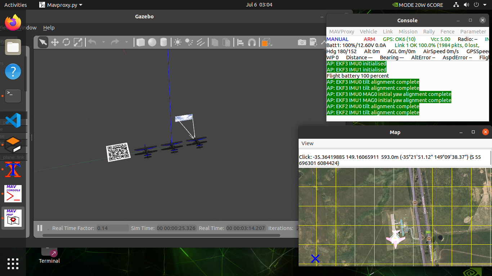

# Ardupilot Gazebo plugin

This plug-in to operate multiple fixed-wing aircraft using ROS in a virtual world that supports barcodes and cameras.

## Requirements：

ubuntu20.04、Gazebo Classic 11、ROS-Noetic



## Setup：

### Gazabo and plugin

```bash
sudo apt-get install libgazebo11-dev	
git clone https://github.com/Haris-Alsaman/ardupilot_gazebo.git
cd ardupilot_gazebo
mkdir build
cd build
cmake ..
make -j4
sudo make install
```

#### sources 

```
sudo vim ~/.bashrc


source /usr/share/gazebo/setup.sh
export GAZEBO_MODEL_PATH=~/ardupilot_gazebo/models:${GAZEBO_MODEL_PATH}
export GAZEBO_MODEL_PATH=~/ardupilot_gazebo/models_gazebo:${GAZEBO_MODEL_PATH}
export GAZEBO_RESOURCE_PATH=~/ardupilot_gazebo/worlds:${GAZEBO_RESOURCE_PATH}
export GAZEBO_PLUGIN_PATH=~/ardupilot_gazebo/build:${GAZEBO_PLUGIN_PATH}


source ~/.bashrc
```


### install Mavros

```bash
sudo apt install ros-noetic-mavros* -y 
cd /opt/ros/noetic/lib/mavros
sudo chmod +x install_geographiclib_datasets.sh
./install_geographiclib_datasets.sh
```

### Make ROS 


### Make ROS and Run Gazebo
```bash
cd ardupilot_gazebo/ros/
catkin_make  #First Time
source devel/setup.bash  
```

#### before run gazebo we sholud 


#### Run Sim
```bash
sim_vehicle.py -v ArduPlane -f gazebo-zephyr --console  --out=127.0.0.1:14550 -I0 --sysid=1  

sim_vehicle.py -v ArduPlane -f gazebo-zephyr --console  --out=127.0.0.1:14560 -I1 --sysid=2 

sim_vehicle.py -v ArduPlane -f gazebo-zephyr --console  --out=127.0.0.1:14570 -I2 --sysid=3
```


## For Make it Easier

### source Ros and Scripts
```
sudo vim ~/.bashrc


export PATH=$PATH:~/ardupilot_gazebo/scripts
source ~/ardupilot_gazebo/ros/devel/setup.bash

source ~/.bashrc
```

### run it from any where by one line

1.terminal 
```
start_gazebo_multi_plane.sh
```

2.terminal
```
start_1_plane.sh
```


